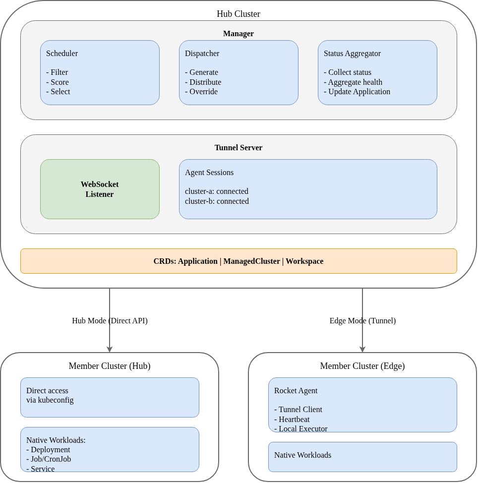

# Rocket

[English](README.md)

[](https://goreportcard.com/report/github.com/hex-techs/rocket)
[](LICENSE)

**Rocket** 是一个云原生多集群应用管理平台，旨在简化跨多个 Kubernetes 集群的应用分发、调度和管理。

## ✨ 特性

- **🌐 多集群管理**：从单一控制平面管理数十个 Kubernetes 集群
- **📦 统一应用分发**：一次编写，到处部署，使用标准 K8s 工作负载
- **🎯 智能调度**：高级调度引擎，支持 Spread、BinPacking 和 Affinity 策略
- **🔄 双重连接模式**：同时支持 Hub（拉取）和 Edge（推送）集群连接方式
- **🎛️ 基于策略的覆盖**：无需复制 YAML 即可按集群自定义配置
- **📊 全局状态聚合**：实时查看所有集群中的应用健康状态
- **🔌 可扩展的插件系统**：支持 MCS、监控和自定义扩展的插件架构

## 🏗️ 架构

Rocket 采用 Hub-Spoke 架构来高效管理多集群环境。



### 组件

| 组件 | 描述 |
|-----------|-------------|
| **Manager** | 运行在 Hub 集群上的中央控制平面。管理 Application 和 Cluster CRDs。 |
| **调度器** | 基于插件的 Filter/Score 架构的多集群调度引擎。 |
| **分发器** | 生成原生 K8s 资源并分发到目标集群。 |
| **隧道服务器** | 基于 WebSocket 的反向隧道，用于 Edge 集群连接。 |
| **Agent** | 运行在 Edge 集群上，维护隧道连接并执行工作负载。 |

### 连接模式

| 模式 | 方向 | 使用场景 |
|------|-----------|----------|
| **Hub** | Manager → 集群 | 可从 Hub 访问的集群（同一 VPC、VPN） |
| **Edge** | Agent → Manager | 位于 NAT/防火墙后的集群，无入站访问 |

## 🚀 快速开始

### 前提条件

- Go 1.22+
- Docker
- Kind（用于本地测试）
- kubectl

### 安装

```bash
# 克隆仓库
git clone https://github.com/hex-techs/rocket.git
cd rocket

# 构建二进制文件
make build

# 将 CRDs 安装到集群
kubectl apply -f config/crd/bases/
```

### 部署 Manager

```bash
# 使用 Helm
helm install rocket-manager charts/manager -n rocket-system --create-namespace

# 或手动部署
kubectl apply -f config/manager/
```

### 注册集群（Hub 模式）

```yaml
apiVersion: storage.rocket.io/v1alpha1
kind: ManagedCluster
metadata:
  name: production-east
  labels:
    env: production
    region: us-east
spec:
  connectionMode: Hub
  apiServer: https://prod-east.example.com:6443
  secretRef:
    name: prod-east-credentials
```

### 部署应用

```yaml
apiVersion: apps.rocket.io/v1alpha1
kind: Application
metadata:
  name: nginx-app
  namespace: default
spec:
  replicas: 6
  workload:
    apiVersion: apps/v1
    kind: Deployment
  template:
    metadata:
      labels:
        app: nginx
    spec:
      containers:
      - name: nginx
        image: nginx:1.25
        resources:
          requests:
            cpu: 100m
            memory: 128Mi
  clusterAffinity:
    requiredDuringSchedulingIgnoredDuringExecution:
      nodeSelectorTerms:
      - matchExpressions:
        - key: env
          operator: In
          values: ["production"]
```

## 📖 文档

| 文档 | 描述 |
|----------|-------------|
| [架构设计](docs/architecture_zh.md) | 详细的系统架构和设计 |
| [调度器设计](docs/scheduler_zh.md) | 多集群调度框架 |
| [拓扑分布](docs/topology_spread_zh.md) | 跨区域/可用区工作负载分布 |
| [Edge 集群](docs/edge_zh.md) | 基于隧道的 Edge 集群管理 |
| [API 参考](docs/api_zh.md) | CRD 规范和示例 |

## 🧪 测试

### 单元测试

```bash
make test
```

### E2E 测试

```bash
# 使用 Kind 运行完整 E2E 测试套件
make e2e-kind

# 或分步执行
make e2e-kind-create  # 创建 Kind 集群
make e2e-kind-test    # 运行测试
make e2e-kind-delete  # 清理
```

## 🤝 贡献

欢迎贡献！请阅读我们的[贡献指南](CONTRIBUTING.md)了解详情。

## 📄 许可证

Rocket 采用 Apache License 2.0 许可。详见 [LICENSE](LICENSE)。
