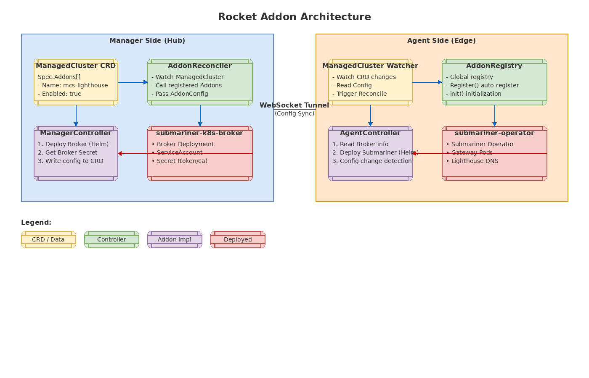
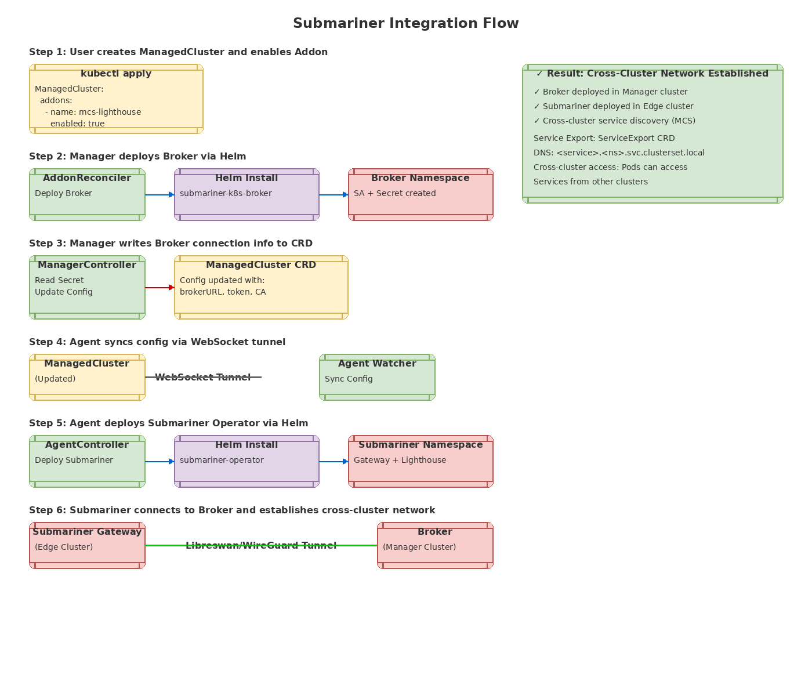
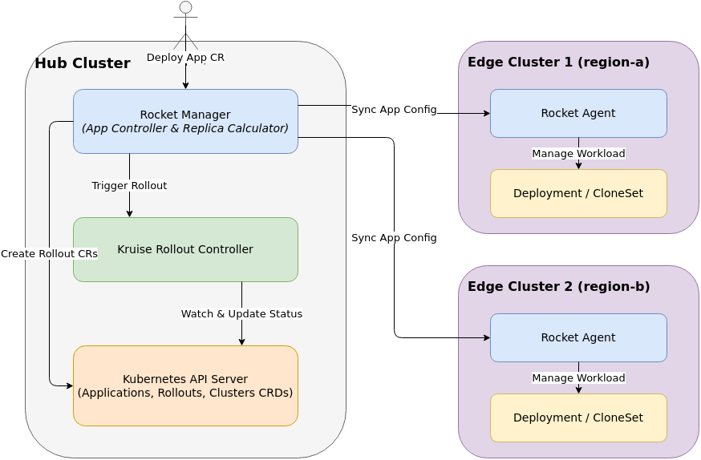
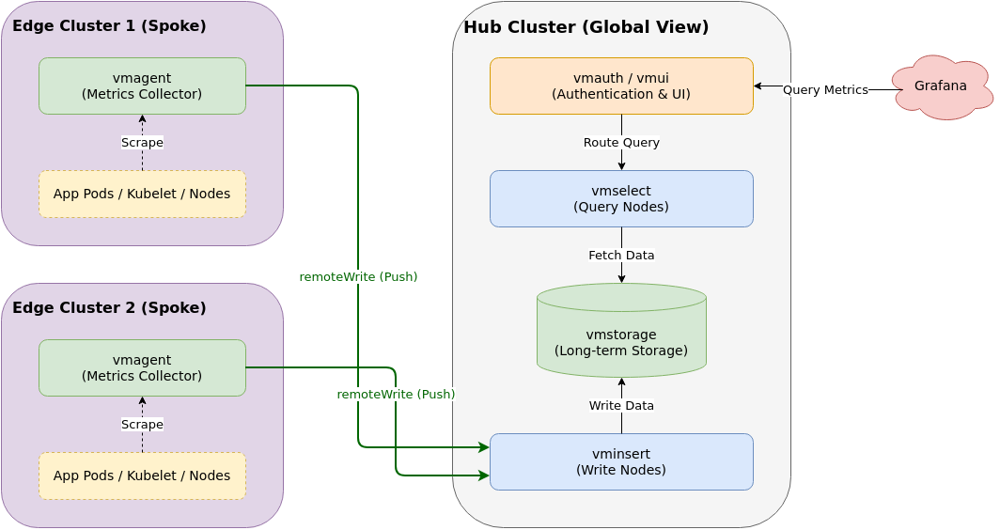

# Addon 扩展设计

[English](addon.md)

## 概述

Rocket 采用 **Addon（插件）机制** 实现功能扩展,支持将第三方组件无缝集成到多集群管理平台中。本文档介绍 Addon 的核心架构、实现原理和使用方法。

## 架构总览



## 核心概念

### 1. Addon 接口定义

Addon 是 Rocket 扩展功能的标准接口,每个 Addon 需要实现以下方法:

```go
type Addon interface {
    // Name 返回 Addon 的唯一标识符
    Name() string
    
    // ManagerController 返回 Manager 端控制器实现
    // 如果 Addon 仅在 Agent 端运行,返回 nil
    ManagerController(mgr ctrl.Manager) (AddonController, error)
    
    // AgentController 返回 Agent 端控制器实现
    // 如果 Addon 仅在 Manager 端运行,返回 nil
    AgentController(mgr ctrl.Manager) (AddonController, error)
    
    // Manifests 返回 Addon 所需的通用 CRD 或资源
    Manifests() []runtime.Object
}
```

### 2. AddonController 接口

AddonController 定义了 Addon 的协调逻辑:

```go
type AddonController interface {
    // Reconcile 处理 Addon 的生命周期
    // 包括安装、升级、配置更新、卸载等
    Reconcile(ctx context.Context, config AddonConfig) error
}

type AddonConfig struct {
    ClusterName string            // 目标集群名称
    Config      map[string]string // Addon 配置
    Client      client.Client     // Kubernetes 客户端
}
```

### 3. 双侧控制器模式

Rocket 采用 **双侧控制器模式**,将 Addon 的部署分为 Manager 端和 Agent 端:

| 端 | 职责 | 适用场景 |
|----|------|---------|
| **Manager 端** | 在 Hub 集群部署核心组件 | Broker、控制平面、配置管理 |
| **Agent 端** | 在成员集群部署工作负载 | Operator、数据平面、本地代理 |

这种设计的优势:
- ✅ 支持 Hub-Spoke 架构
- ✅ 职责清晰,便于维护
- ✅ 可独立部署和升级
- ✅ 支持 Edge 模式(反向隧道)

## 全局注册机制

### 1. 注册表实现

Rocket 使用全局注册表管理所有 Addon:

```go
// internal/addon/manager.go
var globalRegistry = &defaultRegistry{
    registry: make(map[string]Addon),
}

func Register(addon Addon) {
    globalRegistry.Register(addon)
}

func Get(name string) Addon {
    return globalRegistry.Get(name)
}

func List() []Addon {
    return globalRegistry.List()
}
```

### 2. 自动注册

使用 Go 的 `init()` 函数实现自动注册:

```go
// internal/addon/mcs/mcs.go
func init() {
    addon.Register(&MCSAddon{})  // 程序启动时自动注册
}
```

### 3. 控制器初始化

Manager 启动时,AddonReconciler 会自动初始化所有已注册的 Addon:

```go
func (r *AddonReconciler) SetupWithManager(mgr ctrl.Manager) error {
    r.Controllers = make(map[string]addon.AddonController)
    
    // 遍历所有已注册的 Addon
    for _, a := range r.getRegistry().List() {
        c, err := a.ManagerController(mgr)
        if err != nil {
            return err
        }
        if c != nil {
            r.Controllers[a.Name()] = c
        }
    }
    
    return ctrl.NewControllerManagedBy(mgr).
        For(&storagev1alpha1.ManagedCluster{}).
        Complete(r)
}
```

## 配置传递机制

### 配置流程

```
1. 用户在 ManagedCluster.Spec.Addons 中启用 Addon:
   ManagedCluster {
       Spec: {
           Addons: [{
               Name: "mcs-lighthouse",
               Enabled: true,
               Config: {
                   "brokerChartVersion": "0.23.0-m0",
                   "submarinerChartVersion": "0.23.0-m0",
               }
           }]
       }
   }

2. Manager 端 AddonReconciler 监听变更:
   ├─ 调用 ManagerController.Reconcile()
   ├─ 部署核心组件(Broker)
   ├─ 获取连接信息(token, ca)
   └─ 更新 ManagedCluster.Spec.Addons[].Config:
       {
           "brokerURL": "https://manager-api:6443",
           "brokerToken": "eyJhbG...",
           "brokerCA": "LS0tLS...",
           "brokerNamespace": "submariner-k8s-broker"
       }

3. Agent 端通过 WebSocket 隧道同步配置:
   ├─ 监听 ManagedCluster 更新
   ├─ 读取最新的 Config
   └─ 调用 AgentController.Reconcile()
       └─ 部署工作负载组件(Operator)
```

### 配置回写示例

```go
// Manager 端将 Broker 连接信息回写到 CRD
func (c *ManagerController) Reconcile(ctx context.Context, config addon.AddonConfig) error {
    // 1. 部署 Broker
    if err := c.ensureBroker(ctx, config); err != nil {
        return err
    }
    
    // 2. 获取 Broker 连接信息
    brokerInfo, err := c.getBrokerInfo(ctx, config.Config)
    if err != nil {
        return err
    }
    
    // 3. 更新 ManagedCluster.Spec.Addons[].Config
    cluster := &storagev1alpha1.ManagedCluster{}
    if err := config.Client.Get(ctx, types.NamespacedName{Name: config.ClusterName}, cluster); err != nil {
        return err
    }
    
    for i, addon := range cluster.Spec.Addons {
        if addon.Name == AddonName {
            cluster.Spec.Addons[i].Config["brokerURL"] = brokerInfo["brokerURL"]
            cluster.Spec.Addons[i].Config["brokerToken"] = brokerInfo["brokerToken"]
            cluster.Spec.Addons[i].Config["brokerCA"] = brokerInfo["brokerCA"]
            break
        }
    }
    
    return config.Client.Update(ctx, cluster)
}
```

## Submariner 接入实现

### 整体架构

Rocket 使用 Addon 机制集成 Submariner,实现跨集群网络和服务发现:



### 1. Manager 端实现

Manager 端负责部署 Submariner Broker:

```go
type ManagerController struct {
    mgrClient  client.Client
    helmClient helm.HelmClient
}

func (c *ManagerController) Reconcile(ctx context.Context, config addon.AddonConfig) error {
    // 1. 检测 Broker 配置是否变更
    shouldUpdate := c.shouldUpdateBroker(config.Config)
    
    // 2. 部署/升级 Broker (通过 Helm)
    if shouldUpdate {
        chartURL, err := resolveChartURL(chartURLConfig{
            RepoURL:      config.Config[ConfigBrokerChartRepoURL],
            ChartName:    "submariner-k8s-broker",
            ChartVersion: config.Config[ConfigBrokerChartVersion],
        })
        
        values := map[string]interface{}{
            "submariner": map[string]interface{}{
                "serviceDiscovery": true,
            },
        }
        
        helmClient.InstallOrUpgrade("submariner-k8s-broker", chartURL, values)
    }
    
    // 3. 获取 Broker Secret
    secret := &corev1.Secret{}
    c.mgrClient.Get(ctx, types.NamespacedName{
        Name:      "submariner-k8s-broker-client-token",
        Namespace: "submariner-k8s-broker",
    }, secret)
    
    token := string(secret.Data["token"])
    ca := base64.StdEncoding.EncodeToString(secret.Data["ca.crt"])
    
    // 4. 更新 ManagedCluster 配置
    // (见上文"配置回写示例")
}
```

### 2. Agent 端实现

Agent 端负责部署 Submariner Operator:

```go
type AgentController struct {
    helmClient helm.HelmClient
}

func (c *AgentController) Reconcile(ctx context.Context, config addon.AddonConfig) error {
    // 1. 从 Config 读取 Broker 连接信息
    brokerURL := config.Config["brokerURL"]
    brokerToken := config.Config["brokerToken"]
    brokerCA := config.Config["brokerCA"]
    
    // 2. 部署 Submariner Operator (通过 Helm)
    chartURL, err := resolveChartURL(chartURLConfig{
        RepoURL:      config.Config[ConfigSubmarinerChartRepoURL],
        ChartName:    "submariner-operator",
        ChartVersion: config.Config[ConfigSubmarinerChartVersion],
    })
    
    values := map[string]interface{}{
        "broker": map[string]interface{}{
            "server":    brokerURL,
            "token":     brokerToken,
            "namespace": "submariner-k8s-broker",
            "ca":        brokerCA,
        },
        "submariner": map[string]interface{}{
            "clusterId":        config.ClusterName,
            "natEnabled":       false,
            "serviceDiscovery": true,
        },
    }
    
    helmClient.InstallOrUpgrade("submariner", chartURL, values)
}
```

### 3. 配置变更检测

支持检测配置变更并触发升级:

```go
// Broker 配置变更检测
func (c *ManagerController) shouldUpdateBroker(cfg map[string]string) bool {
    if c.lastBrokerConfig == nil {
        return true  // 首次安装
    }
    
    // 比较关键配置
    keys := []string{
        ConfigBrokerChartURL,
        ConfigBrokerChartVersion,
        ConfigBrokerValuesConfigMap,
        // ...
    }
    
    for _, key := range keys {
        if c.lastBrokerConfig[key] != cfg[key] {
            return true
        }
    }
    
    return false
}

// Submariner 配置变更检测 (类似)
func (c *AgentController) hasSubmarinerConfigChanged(cfg map[string]string) bool {
    // 检测 Chart 版本、Broker Token 等是否变更
}
```

## 使用示例

### 1. 启用 Addon

在 `ManagedCluster` 中启用 Addon:

```yaml
apiVersion: storage.rocket.io/v1alpha1
kind: ManagedCluster
metadata:
  name: cluster-1
spec:
  connectionMode: Hub
  addons:
    - name: mcs-lighthouse
      enabled: true
      config:
        brokerChartVersion: "0.23.0-m0"
        submarinerChartVersion: "0.23.0-m0"
```

### 2. 自定义 Helm Values

通过 ConfigMap 自定义 Helm Values:

```yaml
apiVersion: storage.rocket.io/v1alpha1
kind: ManagedCluster
metadata:
  name: cluster-1
spec:
  addons:
    - name: mcs-lighthouse
      enabled: true
      config:
        brokerChartVersion: "0.23.0-m0"
        brokerValuesConfigMap: "my-broker-values"
        brokerValuesNamespace: "default"
---
apiVersion: v1
kind: ConfigMap
metadata:
  name: my-broker-values
  namespace: default
data:
  values.yaml: |
    submariner:
      serviceDiscovery: true
      broker:
        globalnet: true
```

### 3. 查看状态

查看 Addon 配置和状态:

```bash
kubectl get managedcluster cluster-1 -o yaml

# 查看 Addon 配置(已回写)
spec:
  addons:
    - name: mcs-lighthouse
      enabled: true
      config:
        brokerChartVersion: "0.23.0-m0"
        brokerURL: "https://10.0.0.1:6443"
        brokerToken: "eyJhbG..."
        brokerCA: "LS0tLS..."
        brokerNamespace: "submariner-k8s-broker"
```

## 设计亮点

| 设计点 | 说明 | 优势 |
|--------|------|------|
| **全局注册表** | init() 自动注册,无硬编码 | 扩展性强,符合开闭原则 |
| **双侧控制器** | Manager + Agent 分离部署 | 支持 Hub/Edge 架构 |
| **配置回写** | Manager 将连接信息写入 CRD | Agent 通过 CRD 同步,解耦通信 |
| **Helm 集成** | 通过 Helm 部署组件 | 版本可控,支持升级回滚 |
| **变更检测** | lastConfig 缓存 + key 比较 | 避免重复安装,支持升级 |
| **自定义 Values** | 支持 ConfigMap/Secret 注入 | 灵活性高,满足差异化需求 |
| **幂等性设计** | InstallOrUpgrade 自动处理 | 多次调用不会出错 |

## 最佳实践

### 1. Addon 命名规范

- 使用小写字母和连字符
- 格式: `<功能>-<类型>`
- 示例: `mcs-lighthouse`, `istio-mesh`, `monitoring-prometheus`

### 2. 配置管理

- 将敏感信息存储在 Secret 中
- 使用 ConfigMap 存储非敏感配置
- 支持环境变量覆盖默认值

### 3. 错误处理

- 区分临时错误和永久错误
- 临时错误返回 error 触发重试
- 永久错误更新状态并停止重试

### 4. 版本兼容性

- 在 Addon 中记录支持的版本范围
- 提供版本升级路径
- 支持降级回滚

## 内置 Addon 列表

| Addon 名称 | 功能 | Manager 端 | Agent 端 |
|-----------|------|-----------|---------|
| **mcs-lighthouse** | 跨集群服务发现 | Broker | Submariner Operator |
| **kruise-rollout** | 跨集群渐进式发布 | 状态协调 | kruise-rollout 安装 |
| **victoriametrics** | 多集群监控 | VictoriaMetrics Single | vmagent |

## Submariner 使用指南

### 网络模式说明

Submariner 支持多种网络模式,根据你的基础设施选择合适的模式:

| 模式 | 网络要求 | 适用场景 | 配置方式 |
|------|----------|----------|----------|
| **IPsec 隧道** | 集群间网络隔离 | 公有云、跨数据中心 | 默认模式,自动建立加密隧道 |
| **WireGuard 隧道** | 集群间网络隔离 | 高性能需求场景 | 设置 `cableDriver: wireguard` |
| **VXLAN 隧道** | 集群间可达 | VPC Peering、本地网络 | 设置 `cableDriver: vxlan` |
| **扁平网络** | Pod CIDR 跨集群路由 | 已配置路由的扁平网络 | 设置 `natEnabled: false` |

### 扁平网络配置

如果你的集群已经配置了跨集群路由(Pod CIDR 在所有集群间可路由),可以使用扁平网络模式,无需建立隧道:

#### 前提条件

1. **Pod CIDR 路由已配置**: 所有集群的 Pod CIDR 已在底层网络中配置路由,Pod IP 跨集群直接可达
2. **Service CIDR 可达**: ClusterIP Service 的 ClusterIP 在集群间可路由(可选,取决于需求)
3. **无需 NAT**: 集群间通信不需要网络地址转换

#### 配置方式

在 ManagedCluster 中配置:

```yaml
apiVersion: storage.rocket.io/v1alpha1
kind: ManagedCluster
metadata:
  name: cluster-1
spec:
  connectionMode: Hub
  addons:
    - name: mcs-lighthouse
      enabled: true
      config:
        submarinerChartVersion: "0.23.0-m0"
        # 通过 ConfigMap 自定义 values
        submarinerValuesConfigMap: "submariner-values"
        submarinerValuesNamespace: "default"
---
apiVersion: v1
kind: ConfigMap
metadata:
  name: submariner-values
  namespace: default
data:
  values.yaml: |
    submariner:
      clusterId: cluster-1
      natEnabled: false          # 禁用 NAT
      serviceDiscovery: true      # 启用服务发现
      # 不需要 cableDriver,或者设置为空
```

#### 工作原理

在扁平网络模式下:

1. **服务发现层 (Lighthouse)** 仍然需要,用于:
   - ServiceExport/ServiceImport 同步
   - DNS 解析 (`*.clusterset.local`)
   - EndpointSlice 传播

2. **数据平面层 (Gateway Engine)** 不需要:
   - 不建立 IPsec/WireGuard/VXLAN 隧道
   - 流量直接通过底层网络路由

3. **Route Agent** 可能需要,取决于网络配置:
   - 如果节点路由表需要更新,仍需 Route Agent
   - 如果路由已配置,可以禁用 Route Agent

#### 网络路由配置示例

扁平网络需要在底层网络设备或云平台配置路由,例如:

```bash
# 集群 A (Pod CIDR: 10.244.0.0/16)
# 在集群 B 的节点上添加路由
ip route add 10.244.0.0/16 via <cluster-a-gateway-ip>

# 集群 B (Pod CIDR: 10.245.0.0/16)
# 在集群 A 的节点上添加路由
ip route add 10.245.0.0/16 via <cluster-b-gateway-ip>
```

或在云平台 VPC 路由表中配置:

| 目标 CIDR | 下一跳类型 | 下一跳 |
|-----------|-----------|--------|
| 10.244.0.0/16 | 对等连接 | cluster-a-vpc |
| 10.245.0.0/16 | 对等连接 | cluster-b-vpc |

> 💡 **注意**: 上述路由配置仅为示例，实际配置需要根据你的网络架构、云平台和基础设施进行调整。这些配置需要用户自行完成，Rocket 不会自动配置或管理这些底层网络路由。

### 使用限制

> ⚠️ **重要声明**: Rocket 仅提供跨集群服务发现和网络互通的基础能力。对于复杂的网络场景（如扁平网络路由配置、跨云网络互通、混合云架构等），需要用户根据实际环境自行规划和维护底层网络设施。Rocket 不负责也不参与底层网络的路由配置、安全策略、网络设备管理等运维工作。

#### 1. 网络互通要求

- **必须**: 所有成员集群与 Hub 集群网络互通(可访问 Hub API Server)
- **必须**: Hub 集群可访问 Broker API Server
- **视情况**: 成员集群间是否需要互通取决于网络模式

#### 2. 资源需求

| 组件 | CPU | 内存 | 说明 |
|------|-----|------|------|
| Broker | 100m | 128Mi | 运行在 Hub 集群 |
| Operator | 100m | 128Mi | 每个成员集群 |
| Lighthouse Agent | 50m | 64Mi | 每个成员集群 |
| Lighthouse CoreDNS | 50m | 64Mi | 每个成员集群 |
| Gateway Engine | 200m | 256Mi | 仅隧道模式需要 |
| Route Agent | 50m | 64Mi | 每个节点,仅需要时 |

#### 3. 端口要求

隧道模式需要开放以下端口:

| 端口 | 协议 | 用途 | 说明 |
|------|------|------|------|
| 4500/UDP | IPsec | IPsec NAT-T | 默认 IPsec 模式 |
| 51871/UDP | WireGuard | WireGuard | WireGuard 模式 |
| 4800/UDP | VXLAN | VXLAN | VXLAN 模式 |

扁平网络模式无需额外端口。

#### 4. 集群 ID 唯一性

每个集群必须有唯一的 `clusterId`,用于区分不同集群的服务:

```yaml
# ❌ 错误: 多个集群使用相同 ID
spec:
  addons:
    - name: mcs-lighthouse
      config:
        clusterId: "default"  # 所有集群都一样

# ✅ 正确: 每个集群使用唯一 ID
spec:
  addons:
    - name: mcs-lighthouse
      config:
        clusterId: "cluster-east-1"  # 唯一标识
```

#### 5. 版本兼容性

- Broker 和 Agent 版本应保持一致
- Rocket 内置的 Submariner 版本: `0.23.0-m0`
- 支持通过配置覆盖版本(需确保兼容性)

### 常见问题

#### Q1: 如何判断是否需要扁平网络模式?

**A**: 如果你的环境满足以下任一条件,可以考虑扁平网络:
- 所有集群在同一 VPC/VNet,且 Pod CIDR 已路由
- 使用 VPC Peering,且已配置跨 VPC 路由
- 本地数据中心,网络设备已配置跨集群路由
- 集群间网络已通过其他方式打通(如 SD-WAN)

#### Q2: 扁平网络模式下还需要 Broker 吗?

**A**: **是的,仍然需要 Broker**。Broker 用于:
- 存储集群元数据
- 同步 ServiceExport/ServiceImport
- Lighthouse Agent 连接的中央 API Server

扁平网络仅影响数据平面,不影响控制平面。

#### Q3: 如何验证跨集群网络是否可达?

**A**: 在扁平网络模式下,测试方法:

```bash
# 在集群 A 的节点上
kubectl run test --image=busybox --rm -it -- ping <cluster-b-pod-ip>

# 测试 DNS 解析
kubectl run test --image=busybox --rm -it -- \
  nslookup nginx.default.svc.clusterset.local

# 测试服务访问
kubectl run test --image=busybox --rm -it -- \
  wget -qO- nginx.default.svc.clusterset.local
```

#### Q4: 跨集群服务访问失败怎么办?

**A**: 按以下步骤排查:

1. **检查服务导出**:
   ```bash
   kubectl get serviceexport -A
   kubectl describe serviceexport nginx
   ```

2. **检查服务导入**:
   ```bash
   kubectl get serviceimport -A
   kubectl describe serviceimport nginx
   ```

3. **检查 DNS 解析**:
   ```bash
   kubectl logs -n submariner-operator <lighthouse-coredns-pod>
   ```

4. **检查网络连通性**:
   ```bash
   # 查看 EndpointSlice 中的 Pod IP
   kubectl get endpointslice -o yaml
   
   # 测试 Pod IP 是否可达
   ping <remote-pod-ip>
   ```

5. **查看 Lighthouse Agent 日志**:
   ```bash
   kubectl logs -n submariner-operator <lighthouse-agent-pod>
   ```

> 💡 **提示**: 如果网络连通性问题涉及底层网络配置（如路由、防火墙、VPC Peering 等），需要用户自行排查和配置。Rocket 仅负责服务发现层面的功能，不负责底层网络的运维。

## Kruise-Rollout 使用指南

### 概述

Kruise-Rollout Addon 为 Rocket 提供跨集群渐进式发布能力，支持 Canary（金丝雀）、Blue-Green（蓝绿）、A/B Test 三种发布策略。该 Addon 基于 [OpenKruise Rollout](https://openkruise.io/docs/rollout/overview) 实现，Rocket 负责协调多集群发布流程。

### 架构设计



### 启用 Addon

在成员集群上启用 kruise-rollout：

```yaml
apiVersion: storage.rocket.io/v1alpha1
kind: ManagedCluster
metadata:
  name: cluster-1
spec:
  connectionMode: Edge
  addons:
    - name: kruise-rollout
      enabled: true
      config:
        chartVersion: "0.5.0"  # 可选，指定 chart 版本
```

### 发布策略

#### 1. Canary（金丝雀发布）

Canary 发布支持多批次渐进式更新，每批更新一定比例的 Pod。

**基本配置**：

```yaml
apiVersion: apps.rocket.io/v1alpha1
kind: Application
metadata:
  name: my-app
spec:
  workload:
    apiVersion: apps/v1
    kind: Deployment
  replicas: 100
  rolloutStrategy:
    type: Canary
    canary:
      steps:
        - weight: 20      # 第一批：20%
          pause:
            duration: 60  # 暂停 60 秒
        - weight: 50      # 第二批：50%
          pause:
            duration: 60
        - weight: 100     # 第三批：100%
```

**跨集群分批发布**：

通过 `globalReplicaDistribution` 配置，Rocket 会自动计算每个集群应发布的 Pod 数量：

```yaml
apiVersion: apps.rocket.io/v1alpha1
kind: Application
metadata:
  name: my-app
spec:
  replicas: 100
  rolloutStrategy:
    type: Canary
    canary:
      steps:
        - weight: 20
      globalReplicaDistribution:
        mode: Equal  # 或 Weighted, Sequential
```

##### 分布模式

| 模式 | 描述 | 适用场景 |
|------|------|---------|
| **Equal** | 平均分配到所有集群 | 各集群规模相近 |
| **Weighted** | 按权重分配到各集群 | 集群规模差异大 |
| **Sequential** | 逐个集群发布 | 需要严格控制发布顺序 |

##### 示例：按权重分配

```yaml
globalReplicaDistribution:
  mode: Weighted
  clusterWeights:
    - clusterName: cluster-a
      weight: 30  # 30% 的 canary pod
    - clusterName: cluster-b
      weight: 70  # 70% 的 canary pod
```

##### 示例：按序发布

```yaml
globalReplicaDistribution:
  mode: Sequential
---
# 配合 ClusterOrder 使用
clusterOrder:
  type: Sequential
  clusters:
    - cluster-canary   # 先发布 canary 集群
    - cluster-prod-1   # 再发布生产集群 1
    - cluster-prod-2   # 最后发布生产集群 2
```

#### 2. Blue-Green（蓝绿发布）

蓝绿发布创建完整的新版本环境，验证通过后切换流量。

```yaml
apiVersion: apps.rocket.io/v1alpha1
kind: Application
metadata:
  name: my-app
spec:
  rolloutStrategy:
    type: BlueGreen
    blueGreen:
      activeService: my-app-active    # 当前版本服务
      previewService: my-app-preview  # 新版本预览服务
      autoPromotionEnabled: false     # 手动确认后才切换
      scaleDownDelaySeconds: 600      # 切换后 10 分钟再下线旧版本
```

#### 3. A/B Test（A/B 测试）

A/B Test 将不同集群作为基线和候选版本，用于对比测试。

```yaml
apiVersion: apps.rocket.io/v1alpha1
kind: Application
metadata:
  name: my-app
spec:
  rolloutStrategy:
    type: ABTest
    abTest:
      baselineCluster: cluster-stable      # 基线版本集群
      candidateClusters:                   # 候选版本集群
        - cluster-canary-1
        - cluster-canary-2
      trafficSplit: 30  # 30% 流量到候选版本
```

### Pod 数量计算逻辑

#### 数据来源

分批发布基于**期望副本数**（调度器分配结果），而非实际运行副本数：

```
数据流：
Application.Spec.Replicas (全局期望)
         ↓
Placement.Topology[].Replicas (每个集群期望) ← 分批计算使用此值
         ↓
ClustersStatus[].ReadyReplicas (实际运行)
```

#### 计算示例

假设配置：
- 全局 100 副本，发布 20%
- 集群 A 期望 40 副本
- 集群 B 期望 60 副本

**Equal 模式**：
```
全局 canary = 100 × 20% = 20 个
集群 A canary = 20 / 2 = 10 个
集群 B canary = 20 / 2 = 10 个
```

**Weighted 模式（A:30, B:70）**：
```
集群 A canary = 20 × 30% = 6 个
集群 B canary = 20 × 70% = 14 个
```

**Proportional 模式（默认，无 GlobalReplicaDistribution）**：
```
集群 A canary = 20 × 40/100 = 8 个（按期望副本数比例）
集群 B canary = 20 × 60/100 = 12 个
```

### 流量路由

Rocket 仅负责 Pod 数量的分批，**流量路由由用户自行控制**。可通过以下方式实现：

#### Istio 流量路由

```yaml
rolloutStrategy:
  type: Canary
  canary:
    steps:
      - weight: 20
    trafficRouting:
      istio:
        virtualService: my-app-vs
        destinationRule: my-app-dr
```

用户需要在 Lua 或外部系统中配置 VirtualService 的流量百分比。

#### NGINX Ingress 流量路由

```yaml
rolloutStrategy:
  type: Canary
  canary:
    steps:
      - weight: 20
    trafficRouting:
      nginx:
        ingress: my-app-ingress
        annotationPrefix: nginx.ingress.kubernetes.io
```

### 重要注意事项

#### 1. 发布的是 Pod 数量，不是流量比例

> ⚠️ **重要**：Rocket 的分批发布控制的是 **Pod 数量**，而非流量百分比。流量路由由用户通过 Lua 脚本或外部系统（如 Istio、Nginx Ingress）自行控制。

这意味着：
- `weight: 20` 表示创建 20% 的新版本 Pod
- 流量如何分配到这些 Pod，由用户决定
- 平台没有流量数据，无法感知实际流量分布

#### 2. 基于期望副本数计算

分批计算使用 `Placement.Topology[].Replicas`（调度器分配的期望值），而非实际运行副本数。

**优点**：
- 声明式设计，发布计划稳定
- 不受运行状态波动影响
- 符合 Kubernetes 设计理念

**场景说明**：
- 若集群 A 期望 40 副本，实际运行 30 个，发布 20% 时仍按 40 副本计算（8 个 canary）
- 这确保发布计划的一致性，避免因临时故障导致发布策略变化

#### 3. kruise-rollout 部署位置

kruise-rollout 应部署在**需要运行业务应用并使用发布策略的集群**上：

| 集群类型 | 是否需要 kruise-rollout | 说明 |
|---------|------------------------|------|
| Hub（仅管理平面） | 否 | 仅运行 Rocket 控制器，不部署业务应用 |
| Hub（管理+业务） | **是** | 既运行 Rocket 控制器，又部署业务应用 |
| Edge（业务集群） | **是** | 运行业务应用 |

**配置示例**：

```yaml
# 场景 1: Hub 集群仅作为管理平面，不部署业务应用
# 无需配置 kruise-rollout addon
apiVersion: storage.rocket.io/v1alpha1
kind: ManagedCluster
metadata:
  name: hub-management-only
spec:
  connectionMode: Hub
  # 无需配置 kruise-rollout

---
# 场景 2: Hub 集群同时运行管理平面和业务应用
# 需要启用 kruise-rollout 以支持业务应用的发布策略
apiVersion: storage.rocket.io/v1alpha1
kind: ManagedCluster
metadata:
  name: hub-with-workloads
spec:
  connectionMode: Hub
  addons:
    - name: kruise-rollout
      enabled: true
      config:
        chartVersion: "0.5.0"

---
# 场景 3: Edge 集群运行业务应用
# 需要启用 kruise-rollout
apiVersion: storage.rocket.io/v1alpha1
kind: ManagedCluster
metadata:
  name: edge-cluster-1
spec:
  connectionMode: Edge
  addons:
    - name: kruise-rollout
      enabled: true
```

> 💡 **最佳实践**：建议将 Hub 集群专用于管理平面，业务应用部署到 Edge 集群。如果 Hub 集群必须同时运行业务应用，请确保为其启用 kruise-rollout addon。

#### 4. 顺序发布的限制

使用 `Sequential` 模式或 `ClusterOrder` 时：
- 前一个集群发布完成后，才会开始下一个集群
- 需要在 Application Status 中检查前序集群的 Rollout 状态
- 若前序集群发布失败，后续集群不会开始发布

#### 5. 与 Workload 的兼容性

支持的工作负载类型：
- Deployment
- StatefulSet
- CloneSet（OpenKruise）
- Advanced StatefulSet（OpenKruise）

### 配置选项

| 配置键 | 描述 | 默认值 |
|-------|------|--------|
| `chartVersion` | kruise-rollout chart 版本 | `0.5.0` |
| `chartRepoURL` | Helm Chart 仓库地址 | 官方仓库 |
| `chartName` | Chart 名称 | `kruise-rollout` |
| `valuesConfigMap` | 自定义 Helm values 的 ConfigMap | - |
| `valuesNamespace` | ConfigMap 所在命名空间 | `kruise-rollout` |

### 自定义 Helm Values

```yaml
apiVersion: v1
kind: ConfigMap
metadata:
  name: kruise-rollout-values
  namespace: kruise-rollout
data:
  values.yaml: |
    manager:
      replicas: 2
      resources:
        limits:
          cpu: 500m
          memory: 512Mi
---
apiVersion: storage.rocket.io/v1alpha1
kind: ManagedCluster
metadata:
  name: edge-cluster-1
spec:
  addons:
    - name: kruise-rollout
      enabled: true
      config:
        valuesConfigMap: "kruise-rollout-values"
```

### 验证安装

```bash
# 检查 kruise-rollout 是否安装成功
kubectl get all -n kruise-rollout

# 查看 Rollout CR
kubectl get rollout -A

# 查看发布状态
kubectl describe rollout my-app -n default
```

### 故障排查

#### Q1: Rollout CR 未创建？

**A**: 检查以下几点：
1. Application 是否配置了 `rolloutStrategy`
2. 集群是否启用了 kruise-rollout addon
3. 查看 Manager 日志：`kubectl logs -n rocket-system deployment/rocket-manager`

#### Q2: 发布卡住不动？

**A**: 可能原因：
1. Pod 镜像拉取失败
2. 资源不足，Pod 无法调度
3. 健康检查配置有误
4. 查看Rollout 状态：`kubectl get rollout my-app -o yaml`

#### Q3: 如何手动推进发布？

**A**: 通过修改 Application 的 `rolloutStrategy.canary.steps` 或使用 kubectl 插件：

```bash
# 查看当前状态
kubectl kruise rollout status rollout/my-app

# 手动推进到下一步
kubectl kruise rollout approve rollout/my-app
```

### 相关文档

- [Application API 参考](api_zh.md) - RolloutStrategy 完整定义
- [架构设计](architecture_zh.md) - Rocket 整体架构
- [OpenKruise Rollout 文档](https://openkruise.io/docs/rollout/overview)

---

## VictoriaMetrics 使用指南

### 概述

VictoriaMetrics Addon 在多集群环境中部署监控系统，采用 Hub-Spoke 架构：

- **Hub 端**：部署 VictoriaMetrics 单节点作为中心化监控存储
- **Edge 端**：部署 vmagent 采集本地指标并推送到 Hub

### 架构设计



### 重要说明

⚠️ **VictoriaMetrics Single 内置了 agent 功能**：VictoriaMetrics 单节点部署包含了类似 vmagent 的数据摄取能力。因此，**Hub 集群不会部署单独的 vmagent** - 只有需要采集和转发指标的 Edge 集群才会部署。

**如果您使用自己的 Prometheus 或其他 VictoriaMetrics 集群**，您需要：
1. 根据需要在 Hub 集群上手动部署和配置 vmagent
2. 配置 vmagent 的 `remoteWrite` URL 指向您外部的存储
3. 确保 vmagent 与目标存储之间的网络连通性

### 基本配置

在 Hub 集群上启用 VictoriaMetrics：

```yaml
apiVersion: storage.rocket.io/v1alpha1
kind: ManagedCluster
metadata:
  name: hub-cluster
spec:
  connectionMode: Hub
  addons:
    - name: victoriametrics
      enabled: true
```

在 Edge 集群上启用 vmagent 并连接 Hub：

```yaml
apiVersion: storage.rocket.io/v1alpha1
kind: ManagedCluster
metadata:
  name: edge-cluster
spec:
  connectionMode: Edge
  addons:
    - name: victoriametrics
      enabled: true
      config:
        victoriametricsURL: "http://victoria-metrics-victoria-metrics-single.victoriametrics.svc.cluster.local:8428"
```

### 配置选项

| 配置键 | 描述 | 默认值 |
|-------|------|--------|
| `vmChartVersion` | VictoriaMetrics chart 版本 | `0.33.0` |
| `vmAgentChartVersion` | vmagent chart 版本 | `0.34.0` |
| `vmStorageClass` | VictoriaMetrics 持久化存储类 | 无（不持久化） |
| `vmStorageSize` | 持久化存储大小 | `16Gi` |
| `vmValuesConfigMap` | 自定义 Helm values 的 ConfigMap 名称 | - |
| `victoriametricsURL` | VictoriaMetrics URL（Hub 上自动填充） | 自动检测 |

### 存储配置

默认情况下，VictoriaMetrics 使用 emptyDir（不持久化存储）。生产环境建议配置持久化：

```yaml
apiVersion: storage.rocket.io/v1alpha1
kind: ManagedCluster
metadata:
  name: hub-cluster
spec:
  addons:
    - name: victoriametrics
      enabled: true
      config:
        vmStorageClass: "standard"
        vmStorageSize: "50Gi"
```

### 自定义 Helm Values

通过 ConfigMap 自定义配置：

```yaml
apiVersion: v1
kind: ConfigMap
metadata:
  name: vm-values
  namespace: default
data:
  values.yaml: |
    server:
      persistentVolume:
        enabled: true
        storageClassName: standard
        size: 50Gi
      resources:
        requests:
          cpu: 500m
          memory: 1Gi
---
apiVersion: storage.rocket.io/v1alpha1
kind: ManagedCluster
metadata:
  name: hub-cluster
spec:
  addons:
    - name: victoriametrics
      enabled: true
      config:
        vmValuesConfigMap: "vm-values"
        vmValuesNamespace: "default"
```

### 验证安装

```bash
# 检查 Hub 上的 VictoriaMetrics
kubectl get all -n victoriametrics

# 检查 Edge 上的 vmagent
kubectl get all -n vm-agent

# 查询指标
kubectl port-forward -n victoriametrics svc/victoria-metrics-victoria-metrics-single 8428:8428
curl http://localhost:8428/api/v1/query?query=up
```

## 开发自定义 Addon

### 1. 实现 Addon 接口

```go
package myaddon

import (
    "github.com/fize/rocket/internal/addon"
    ctrl "sigs.k8s.io/controller-runtime"
)

func init() {
    addon.Register(&MyAddon{})
}

type MyAddon struct{}

func (a *MyAddon) Name() string {
    return "my-addon"
}

func (a *MyAddon) ManagerController(mgr ctrl.Manager) (addon.AddonController, error) {
    return &MyManagerController{
        client: mgr.GetClient(),
    }, nil
}

func (a *MyAddon) AgentController(mgr ctrl.Manager) (addon.AddonController, error) {
    return &MyAgentController{}, nil
}

func (a *MyAddon) Manifests() []runtime.Object {
    return []runtime.Object{
        // CRD 定义
    }
}
```

### 2. 实现控制器

```go
type MyManagerController struct {
    client client.Client
}

func (c *MyManagerController) Reconcile(ctx context.Context, config addon.AddonConfig) error {
    // 实现协调逻辑
    // 1. 检查是否已安装
    // 2. 部署组件
    // 3. 更新配置
    return nil
}
```

### 3. 注册 Addon

在 `main.go` 中导入 Addon 包:

```go
import (
    _ "github.com/fize/rocket/internal/addon/mcs"
    _ "github.com/your-org/rocket-addons/my-addon"  // 第三方 Addon
)
```

## 故障排查

### 1. Addon 未生效

**症状**: 启用 Addon 后无反应

**排查步骤**:
```bash
# 1. 检查 ManagedCluster 状态
kubectl get managedcluster <name> -o yaml

# 2. 查看 Manager 日志
kubectl logs -n rocket-system deployment/rocket-manager

# 3. 检查 Addon 是否注册
# 在 Manager 日志中搜索 "Addon registered"
```

### 2. Helm 安装失败

**症状**: Addon 报错 "failed to install via Helm"

**排查步骤**:
```bash
# 1. 检查 Helm Chart 是否存在
helm search repo submariner

# 2. 手动测试 Helm 安装
helm install test-submariner submariner-operator \
  --namespace submariner-operator \
  --set broker.server=<broker-url>

# 3. 检查集群资源
kubectl get all -n submariner-k8s-broker
```

### 3. 配置未同步

**症状**: Agent 端未收到更新后的配置

**排查步骤**:
```bash
# 1. 检查 WebSocket 连接
kubectl logs -n rocket-system deployment/rocket-agent | grep "WebSocket"

# 2. 查看 ManagedCluster 配置
kubectl get managedcluster <name> -o jsonpath='{.spec.addons}'

# 3. 检查 Agent 日志
kubectl logs -n rocket-system deployment/rocket-agent
```

## 相关文档

- [架构设计](architecture_zh.md) - Rocket 整体架构
- [Edge 集群管理](edge_zh.md) - WebSocket 隧道实现
- [API 参考](api_zh.md) - ManagedCluster CRD 规范
