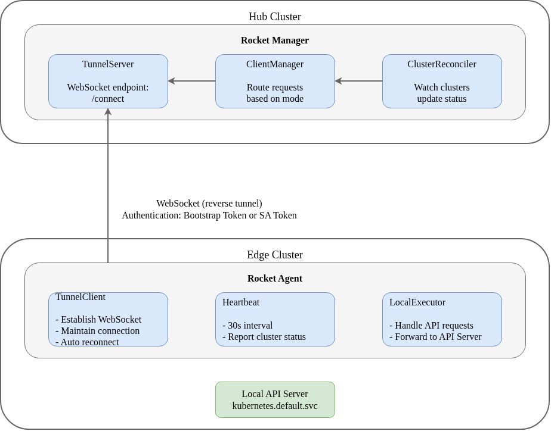

# Edge 集群管理

[English](edge.md)

## 概述

Rocket 支持两种集群连接模式：

| 模式 | 连接方向 | 适用场景 |
|------|---------|----------|
| **Hub** | Manager → 集群 | 可直接访问 API Server 的集群 |
| **Edge** | Agent → Manager | NAT/防火墙后的集群 |

本文档介绍 Edge 模式的配置和使用方法。

## Edge 模式架构



## 连接流程

1. **Agent 启动**：Agent 读取配置，准备连接到 Manager
2. **建立连接**：Agent 向 Manager 的 `/connect` 端点发起 WebSocket 连接
3. **身份验证**：Manager 验证 Agent 提供的认证凭据
4. **维持心跳**：连接建立后，Agent 每 30 秒发送心跳
5. **请求转发**：Manager 的 API 请求通过隧道转发到 Edge 集群

## 部署 Agent

### 前提条件

- Hub 集群已部署 Rocket Manager
- Edge 集群可访问 Manager 的 WebSocket 端口
- 已准备好 Bootstrap Token 或 ServiceAccount Token

### 使用 Helm 安装

```bash
# 添加 Rocket Helm 仓库
helm repo add rocket https://hex-techs.github.io/rocket
helm repo update

# 创建命名空间
kubectl create namespace rocket-system

# 安装 Agent
helm install rocket-agent rocket/agent \
  --namespace rocket-system \
  --set manager.endpoint="wss://manager.example.com:8443" \
  --set cluster.name="edge-cluster-01" \
  --set auth.bootstrapToken="<bootstrap-token>"
```

### Helm 配置参数

```yaml
# values.yaml 示例
manager:
  # Manager 的 WebSocket 端点地址
  endpoint: "wss://manager.example.com:8443"

cluster:
  # 集群名称（必须唯一）
  name: "edge-cluster-01"
  # 集群标签（用于调度）
  labels:
    env: production
    region: edge-site-1
    topology.kubernetes.io/zone: zone-a

auth:
  # Bootstrap Token（用于初始认证）
  bootstrapToken: ""
  # 或使用已存在的 Secret
  existingSecret: ""

agent:
  image:
    repository: ghcr.io/hex-techs/rocket-agent
    tag: latest
  resources:
    requests:
      cpu: 100m
      memory: 128Mi
    limits:
      cpu: 500m
      memory: 512Mi
```

## 注册 Edge 集群

在 Hub 集群创建 ManagedCluster 资源：

```yaml
apiVersion: storage.rocket.io/v1alpha1
kind: ManagedCluster
metadata:
  name: edge-cluster-01
  labels:
    env: production
    topology.kubernetes.io/region: edge-site-1
    topology.kubernetes.io/zone: zone-a
spec:
  # 设置连接模式为 Edge
  connectionMode: Edge
  
  # 可选：设置集群污点
  taints:
  - key: "location"
    value: "edge"
    effect: PreferNoSchedule
```

## 查看集群状态

```bash
# 查看所有集群
kubectl get managedcluster -o wide

# 查看集群详情
kubectl get managedcluster edge-cluster-01 -o yaml
```

输出示例：

```yaml
status:
  # 连接状态
  connectionStatus: Connected
  
  # 就绪状态
  ready: true
  
  # 最后心跳时间
  lastHeartbeatTime: "2026-02-02T12:00:00Z"
  
  # Kubernetes 版本
  version:
    gitVersion: v1.28.0
  
  # 可分配资源
  allocatable:
    cpu: "8"
    memory: "32Gi"
    pods: "110"
  
  # 已请求资源
  requested:
    cpu: "2"
    memory: "8Gi"
  
  # 状态条件
  conditions:
  - type: Ready
    status: "True"
  - type: AgentConnected
    status: "True"
```

## 认证方式

### Bootstrap Token

Bootstrap Token 用于 Agent 的初始认证，格式为 `<token-id>.<token-secret>`。

在 Hub 集群创建 Bootstrap Token：

```yaml
apiVersion: v1
kind: Secret
metadata:
  name: bootstrap-token-<token-id>
  namespace: kube-system
type: bootstrap.kubernetes.io/token
data:
  token-id: <base64-encoded-token-id>
  token-secret: <base64-encoded-token-secret>
  usage-bootstrap-authentication: dHJ1ZQ==
```

### ServiceAccount Token（推荐用于生产）

初始注册后，建议切换到 ServiceAccount Token：

```yaml
apiVersion: v1
kind: ServiceAccount
metadata:
  name: rocket-agent
  namespace: rocket-system
---
apiVersion: rbac.authorization.k8s.io/v1
kind: ClusterRoleBinding
metadata:
  name: rocket-agent
roleRef:
  apiGroup: rbac.authorization.k8s.io
  kind: ClusterRole
  name: cluster-admin
subjects:
- kind: ServiceAccount
  name: rocket-agent
  namespace: rocket-system
```

## 常见问题排查

### Agent 无法连接到 Manager

1. **检查网络连通性**
   ```bash
   # 从 Edge 集群节点测试
   curl -v https://manager.example.com:8443/healthz
   ```

2. **验证认证凭据**
   ```bash
   # 检查 Bootstrap Token 是否存在
   kubectl get secret -n kube-system | grep bootstrap-token
   ```

3. **查看 Agent 日志**
   ```bash
   kubectl logs -n rocket-system -l app=rocket-agent -f
   ```

### 连接不稳定

1. **检查网络延迟**
   ```bash
   ping manager.example.com
   ```

2. **调整心跳超时**
   - 默认：30 秒心跳间隔，90 秒超时
   - 高延迟网络可适当增加超时时间

### 集群状态显示 Disconnected

1. **检查 Agent 运行状态**
   ```bash
   kubectl get pods -n rocket-system -l app=rocket-agent
   ```

2. **查看 Agent 日志**
   ```bash
   kubectl logs -n rocket-system deployment/rocket-agent --tail=100
   ```

3. **检查 Manager 端连接状态**
   ```bash
   # 在 Hub 集群查看 Manager 日志
   kubectl logs -n rocket-system deployment/rocket-manager | grep edge-cluster-01
   ```

## 安全建议

### 网络安全

1. **TLS 加密**：所有隧道通信都通过 TLS 加密
2. **证书验证**：Agent 验证 Manager 的 TLS 证书
3. **最小化暴露**：只需从 Edge 集群出站到 Manager

### 认证安全

1. **定期轮换 Token**：定期更新 Bootstrap Token
2. **最小权限原则**：为 Agent 的 ServiceAccount 配置最小必要权限
3. **审计日志**：启用隧道连接的审计日志

### 生产环境建议配置

```yaml
# Agent Deployment 安全加固
spec:
  template:
    spec:
      securityContext:
        runAsNonRoot: true
        runAsUser: 1000
        fsGroup: 1000
      containers:
      - name: agent
        securityContext:
          allowPrivilegeEscalation: false
          readOnlyRootFilesystem: true
          capabilities:
            drop:
            - ALL
```

## 相关文档

- [架构设计](architecture_zh.md) - 系统整体架构
- [API 参考](api_zh.md) - ManagedCluster 资源详解
