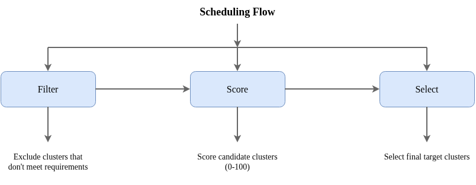

# Scheduler Design

[中文文档](scheduler_zh.md)

## Overview

Rocket Scheduler adopts a plugin-based architecture similar to Kubernetes Scheduler Framework, supporting flexible cluster selection strategies for Application workloads. The scheduler is responsible for selecting the best target clusters for Applications.

## Scheduling Flow



## Scheduling Phases

### 1. Filter Phase

The filter phase excludes clusters that don't meet requirements, keeping only candidate clusters.

**Built-in Filter Plugins:**

| Plugin | Function | Description |
|--------|----------|-------------|
| **Health** | Health check | Excludes clusters that are NotReady or disconnected |
| **Affinity** | Affinity matching | Filters based on `clusterAffinity.requiredDuringSchedulingIgnoredDuringExecution` |
| **TaintToleration** | Taint toleration | Checks if cluster taints are tolerated by application |
| **Capacity** | Resource check | Checks if cluster has sufficient resources for workload |
| **VolumeRestriction** | Storage restriction | Checks if cluster supports required storage types |

### 2. Score Phase

The score phase scores candidate clusters. Each plugin returns a score from 0-100, and final scores are calculated by weighted sum and normalization.

**Built-in Score Plugins:**

| Plugin | Function | Scoring Strategy |
|--------|----------|------------------|
| **Affinity** | Affinity preference | Calculates weighted score based on `preferredDuringSchedulingIgnoredDuringExecution` |
| **Resource** | Resource utilization | Two strategies:<br>- `LeastAllocated`: Prefer clusters with more free resources (load balancing)<br>- `MostAllocated`: Prefer clusters with more used resources (bin packing) |
| **TopologySpread** | Topology spread | Optional score plugin (disabled by default). Prefers topology domains with fewer replicas for even distribution |

### 3. Select Phase

The select phase chooses final target clusters based on configured strategy.

| Strategy | Description | Use Case |
|----------|-------------|----------|
| **SingleCluster** | Select the highest scoring cluster | Simple deployment, single cluster apps |
| **Spread** | Distribute replicas by score weight across clusters | High availability, disaster recovery |

## Scheduling Algorithms

### Scoring Algorithms

#### 1. Resource Scoring Algorithm (Resource Plugin)

The resource scoring plugin supports two strategies:

**LeastAllocated (Default Strategy)**

Prefers clusters with more free resources for load balancing:

```
CPU Score = (Allocatable - Allocated) × 100 / Allocatable
Memory Score = (Allocatable - Allocated) × 100 / Allocatable
Final Score = (CPU Score + Memory Score) / 2
```

**MostAllocated**

Prefers clusters with higher utilization for bin packing (cost optimization):

```
CPU Score = Allocated × 100 / Allocatable
Memory Score = Allocated × 100 / Allocatable
Final Score = (CPU Score + Memory Score) / 2
```

#### 2. Affinity Scoring Algorithm (Affinity Plugin)

Affinity scores are calculated based on `preferredDuringSchedulingIgnoredDuringExecution` preferences:

```
Score = Σ(Matched Preference Weights)
Normalized Score = Score × 100 / Maximum Score
```

Example: If preferences are defined as:
- `tier=high-performance` weight 100
- `has-gpu=true` weight 50

Cluster A matches both rules (score 150), Cluster B matches only the first (score 100). After normalization: A=100, B=67.

#### 3. Topology Spread Scoring Algorithm (TopologySpread Plugin)

The topology spread plugin favors topology domains with fewer replicas for even distribution:

```
Raw Score = Current Replica Count in Topology Domain
Normalized Score = (Max Replicas - Current Replicas) × 100 / Max Replicas
```

Domains with fewer replicas get higher scores, achieving balanced distribution.

#### 4. Final Score Calculation

All plugin scores are combined through weighted sum and normalized to 0-100 range:

```
Weighted Score = Σ(Plugin Score × Plugin Weight)
Final Normalized = (Weighted Score - Min) × 100 / (Max - Min)
```

If all clusters have equal scores, they are set to 50 (neutral value).

### Selection Algorithms

#### SingleCluster Strategy

Selects the single highest-scoring cluster:

```
Iterate through all candidate clusters
Select cluster with highest score (alphabetical tie-breaker)
Assign all replicas to that cluster
```

#### Spread Strategy

Distributes replicas across multiple clusters by weight, using each cluster's final normalized score as the weight.

**Replica Distribution Algorithm (Hamilton Method)**:

```
1. Determine usable cluster count (limited by maxClusters)
2. Calculate each cluster's weight ratio
3. Distribute replicas by weight ratio (floor)
4. Use Largest Remainder Method for remaining replicas
   - Sort clusters by fractional part (descending)
   - Assign 1 replica to each until exhausted
```

**Replica Stability During Scale-Up**:

During scale-up (total replicas increase), the "no reduction" principle applies:

```
1. Preserve each existing cluster's replica count as minimum
2. Only distribute additional replicas by weight
3. Existing clusters may gain replicas but never lose them
```

Example:
- Current distribution: cluster1=3, cluster2=2 (total 5)
- Scale up to 8 replicas
- 3 new replicas distributed by weight
- Result: cluster1=4, cluster2=3, cluster3=1 (assuming cluster3 scores well)

**StatefulSet Waterfill Algorithm**:

StatefulSets use a special waterfill algorithm to maintain ordinal continuity:

```
1. Sort clusters by name for stable ordering
2. Scale-up: Fill sequentially from the last cluster with replicas
3. Scale-down: Remove sequentially from the last cluster backward
```

This ensures StatefulSet Pod ordinals remain ordered across clusters.

## Configuration

### Resource Strategy Configuration

The scheduler supports configuring the resource strategy via command line arguments:

```bash
rocket-manager --scheduler-resource-strategy=MostAllocated
```

Supported strategies:
- `LeastAllocated` (Default): Distributes pods to clusters with the most free resources (spreading).
- `MostAllocated`: Packs pods to clusters with the least free resources (bin-packing).

### Scheduling Strategy (Spread vs SingleCluster)

The default scheduling strategy is `Spread`, which spreads replicas across multiple available clusters. You can override this strategy per Application to use `SingleCluster` (forcing all replicas to the single best cluster) using the `apps.rocket.io/scheduler-strategy` annotation.

#### 1. Spread Strategy (Default)

**Design Philosophy**: Stability first, gradual convergence to ideal distribution.

| Operation | Strategy | Migration | New Cluster Gets Pods? |
|-----------|----------|-----------|------------------------|
| Scale-Up | Distribute by **Deficit** | None (add only) | ✅ Priority |
| Scale-Down | Reduce by **Surplus** | None (delete only) | ❌ Wait for scale-up |

##### Scale-Up Algorithm (Deficit-Based)

1. **Preserve Existing**: Lock current distribution as minimum.
2. **Calculate Deficit**: `deficit = max(0, ideal - current)` for each cluster.
3. **Distribute New Pods**: Allocate new replicas proportionally by deficit.
4. **Remainder Handling**: Use Largest Remainder Method for fractional pods.

**Example (Scale-Up with New Cluster)**:
- Current: Total=5, C1=3, C2=2, C3=0
- Scale to: Total=10
- New Weights: C1=10%, C2=20%, C3=70%
- Ideal (10 pods): C1=1, C2=2, C3=7
- Deficit: C1=0 (over), C2=0 (at ideal), C3=7
- **Result**: All 5 new pods go to C3 → **C1=3, C2=2, C3=5**

##### Scale-Down Algorithm (Surplus-Based)

1. **Calculate Surplus**: `surplus = max(0, current - ideal)` for each cluster.
2. **Reduce from Surplus**: Remove replicas proportionally from over-quota clusters.
3. **No Migration**: Pods are only deleted, never moved to other clusters.

**Example (Scale-Down)**:
- Current: Total=10, C1=6, C2=4
- Scale to: Total=8
- Weights: C1=50%, C2=50%
- Ideal (8 pods): C1=4, C2=4
- Surplus: C1=2, C2=0
- **Result**: Both reductions from C1 → **C1=4, C2=4**

**Important**: New clusters will NOT receive pods during scale-down. They must wait for the next scale-up opportunity.

##### Initial Deployment

Uses standard **Largest Remainder Method (Hamilton Method)** based on weights:
- Deployment with `replicas: 10`
- Available Clusters:
    *   Cluster A (Score: 100) -> Weight ~0.66
    *   Cluster B (Score: 50)  -> Weight ~0.33
- **Calculation**:
    *   Cluster A ideal: 10 * 0.66 = 6.6
    *   Cluster B ideal: 10 * 0.33 = 3.3
- **Result**: Cluster A gets 7 pods, Cluster B gets 3 pods.

#### 2. SingleCluster Strategy
**Behavior**:
1.  **Filter**: Eliminates clusters that don't meet requirements (resources, taints, etc.).
2.  **Score**: Scores remaining clusters based on configured plugins (Resource, Affinity).
3.  **Select**: Picks the single cluster with the highest score.
4.  **Assign**: Deploys **all** replicas to that chosen cluster.

**Example**:
- Deployment with `replicas: 5`
- Cluster A (Score: 80), Cluster B (Score: 60)
- **Result**: All 5 replicas are scheduled to Cluster A.

#### Configuration Example: Forcing SingleCluster

```yaml
apiVersion: apps.rocket.io/v1alpha1
kind: Application
metadata:
  name: my-app
  annotations:
    apps.rocket.io/scheduler-strategy: SingleCluster
spec:
  # ...
```

### Cluster Affinity

Cluster affinity specifies which clusters an application should be scheduled to.

**Required Conditions**

```yaml
spec:
  clusterAffinity:
    requiredDuringSchedulingIgnoredDuringExecution:
      nodeSelectorTerms:
      - matchExpressions:
        - key: env
          operator: In
          values: ["production"]
        - key: region
          operator: In
          values: ["us-east", "us-west"]
```

Supported operators:

| Operator | Description |
|----------|-------------|
| `In` | Label value is in the list |
| `NotIn` | Label value is not in the list |
| `Exists` | Label key exists |
| `DoesNotExist` | Label key does not exist |
| `Gt` | Label value greater than |
| `Lt` | Label value less than |

**Preferred Conditions**

```yaml
spec:
  clusterAffinity:
    preferredDuringSchedulingIgnoredDuringExecution:
    - weight: 100
      preference:
        matchExpressions:
        - key: tier
          operator: In
          values: ["high-performance"]
    - weight: 50
      preference:
        matchExpressions:
        - key: has-gpu
          operator: In
          values: ["true"]
```

### Cluster Taints and Tolerations

Clusters can set taints to repel certain workloads:

```yaml
# Taints on ManagedCluster
spec:
  taints:
  - key: "dedicated"
    value: "gpu"
    effect: NoSchedule
```

Applications can tolerate tainted clusters:

```yaml
# Tolerations on Application
spec:
  clusterTolerations:
  - key: "dedicated"
    operator: "Equal"
    value: "gpu"
    effect: "NoSchedule"
```

Taint effects:

| Effect | Description |
|--------|-------------|
| `NoSchedule` | Don't schedule to this cluster (unless tolerated) |
| `PreferNoSchedule` | Try to avoid scheduling to this cluster |
| `NoExecute` | Don't schedule and evict existing workloads |

## Examples

### Production Deployment

```yaml
apiVersion: apps.rocket.io/v1alpha1
kind: Application
metadata:
  name: production-app
spec:
  replicas: 6
  workload:
    apiVersion: apps/v1
    kind: Deployment
  template:
    # ...
  clusterAffinity:
    requiredDuringSchedulingIgnoredDuringExecution:
      nodeSelectorTerms:
      - matchExpressions:
        - key: env
          operator: In
          values: ["production"]
```

### GPU Workload

```yaml
apiVersion: apps.rocket.io/v1alpha1
kind: Application
metadata:
  name: ml-training
spec:
  workload:
    apiVersion: batch/v1
    kind: Job
  template:
    # ...
  clusterAffinity:
    requiredDuringSchedulingIgnoredDuringExecution:
      nodeSelectorTerms:
      - matchExpressions:
        - key: has-gpu
          operator: In
          values: ["true"]
  clusterTolerations:
  - key: "dedicated"
    value: "gpu"
    effect: "NoSchedule"
```

## Troubleshooting

When an application fails to schedule:

1. **Check application status**
   ```bash
   kubectl get application my-app -o yaml
   ```
   Check `status.conditions` for scheduling-related conditions.

2. **Check cluster status**
   ```bash
   kubectl get managedcluster -o wide
   ```
  Verify `status.state` and `status.conditions` reflect Ready/connected.

3. **Verify cluster labels**
   ```bash
   kubectl get managedcluster -o custom-columns=\
   NAME:.metadata.name,LABELS:.metadata.labels
   ```
   Confirm cluster labels match affinity rules.

4. **Check cluster resources**
   ```bash
   kubectl get managedcluster my-cluster -o yaml
   ```
   Check `status.resourceSummary` for sufficient resources.

## Related Documentation

- [Architecture](architecture.md) - System architecture
- [Topology Spread Guide](topology_spread.md) - Cross-region HA deployment
- [API Reference](api.md) - Application configuration details
